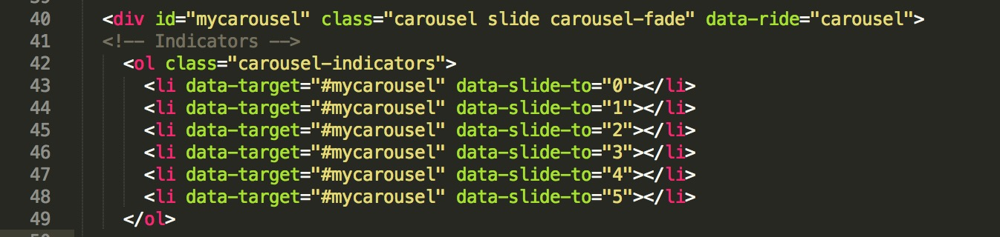
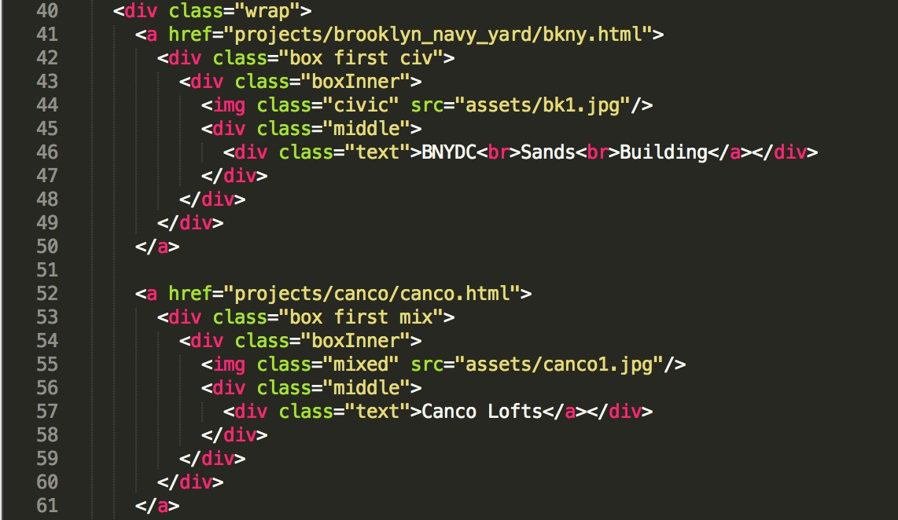
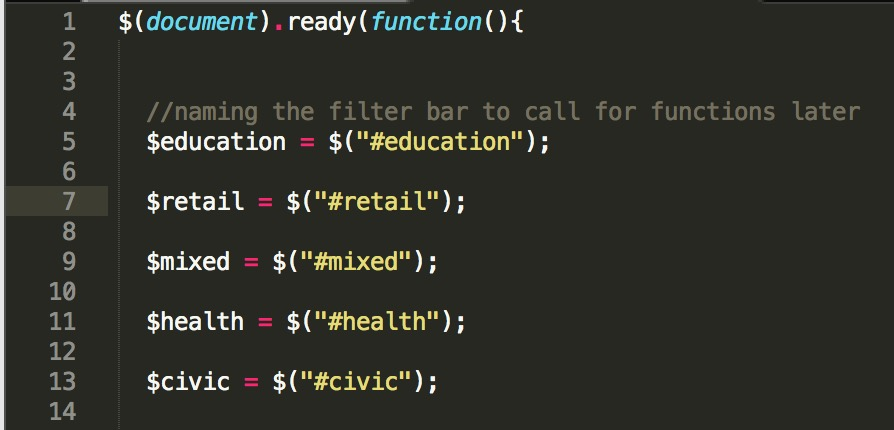
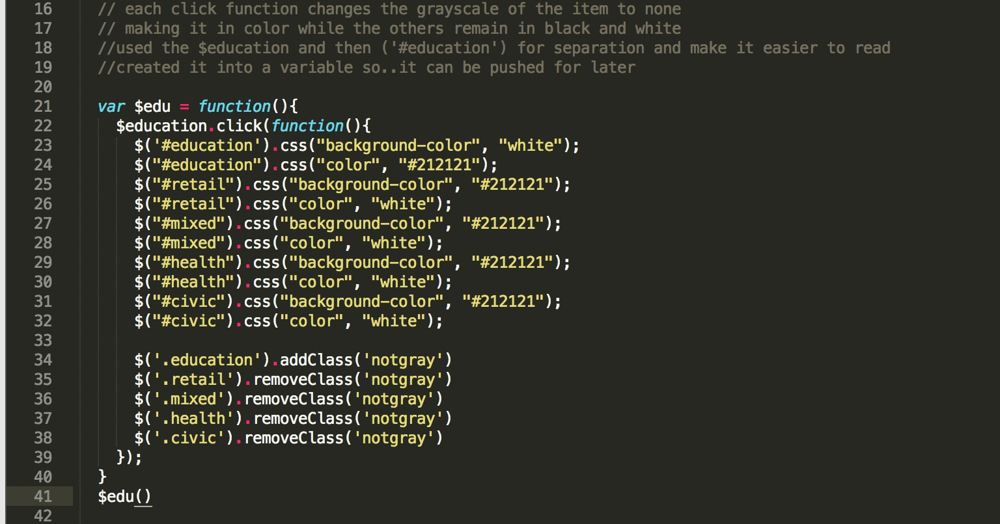

# SBLM

# Home
The home page uses a jquery based slideshow, DOM manipulation, with Bootstrap styling and every page is mobile responsive.

Upon refresh the home page will shuffle an image with a link to the work page where clicked on studio is highlighted.

For example, clicking on the civic link in the home page, will highlight the civic projects in the work page, and so forth.

The photos chosen are in black and white to intice the user to continously click through the page until getting to a final project folder and ultimately see full color images with the according narrative. 

The only color in the page are the studios which guide the user to click on the divs that will direct them further onto the site. 

If the highlighted divs aren't an indicator the nav bar is, which will direct users to the work and contact page.

# Work
The work page contains selected projects by the SBLM curated by the principles. As of right now there are 20 projects with many more to come as proposals get completed. 

The work page is heavy on jquery and DOM manipulation as there is a shuffle function implemented where upon refresh the order of the projects is being changed. 

There is a filter bar where users can filter through each of the five studios and upon doing so the projects associated with the studio will be colorized. 
Hovering over a project will reveal it's title, and clicking on one will lead you to the project page where the user can learn more about the selected proposal and see site photography.

# Projects
The user will see a slideshow which consists of full bleed images. The curated slideshow images will consist of select aspect of the site and reflect a detail of the project.

Users can browse through the images via hovering over a certain section, hovering over the title or the bottom of the image will show an icon and upon click, the user will be scrolled to a site map with a + icon.

Upon clicking the + icon, the projet details will be revealed and the + will be replaced with a - which click on will remove the project details and show the site map.

Below the site map is a detailed flow of the project history, complete with a combination of photos and corresponding narrative.

# Contact
The contact page is simply a list of the offices with corresponding addresses and phone numbers. There is also the option to email SBLM for inquiries and employment opportunities.

# Future edits
### Home Page
For the home page, this is how to add more photos and other edits. 

This is the start of the slideshow. 

Lines 53-58 and 60-65, each are two different slides.

Starting at line 53, the start of the div is given the item class for manipulation in the js file.

Line 54 is the image src, the root file. There is an alt tag which is used for SEO purposes. 

Line 55-57 is the caption and the title of the project. In this example it's DSNY Fresh Kills, and Featured project. DSNY is given and id for styling in the css.

Lines 60-65 is pretty much the same except for the extra h2 tag.

This is the radial button imported from bootstrap. The amount of li items have to be equal to the amount of images. In web developement, the count starts at 0

### Nav Bar
This is the nav bar section, which is pretty straight forward.

It's basically a stylized list. The classes are sblm, and link. With the href linking to the corresponding pages. Clicking on the sblm logo on the home page is basically another way to refresh. The icon class with the burger class will be displayed only when the page is mobile responsive. 

Lines 27-32 are the links for when the page is mobile responsive. They become a different format and arent displayed unless the site is at a certain dimension and or viewed on a device.

We have hardcoded the style because of bootstrap.

### Photo js
The photojs is a bit more complicated, but I'll go through it line by line. I've also commented much of the code to make it easier to breeze through. 

Line 1 "$(document).ready(function(){" is necessary for any pages using jquery and is a vital tool for front end development. It basically means at the start of the page x,y, and z will prop itself. 

Line 2: Giving all items with the class item a variable

Line 3: The height of the browser will be the height of the image

Line 7/8: The height of the item is the size of the browser, and it's given the class of full-screen

Line 11/12: The number of slides is the amount of classes that have the class item. The current slide is going to be a random slide from $numberofSlides

Lines 16-25: Just the bootstrap version of when you click on the radio button it brings you to the associated slide, as well as adding/removing the class active

### Photo js pt 2
The second part to the photo.js file.

Lines 27-36: This is a bootstrap function where it makes the image full screen, and if it can't fit the dimensions, it will add a background color to fill up the space. 

Lines 38-42: When the browser resizes the height of the image changes with the browser.

Lines 44-49: To initiate the carousel, there is no pause between the slides, and each image is displayed for 4000 milliseconds (4 seconds)

### Contact Page

This page is fairly simple, The locations are wrapped in a dive called office, and each location is given a class of where they are, i.e 'nyc.' The br tags are just breaks for layout purposes.

### Work page pt1

The work page is a bit long, alot more Jquery and Javascript. But this first part is the html.

Line 40: This is the start of the projects layout. Wrap, basically wraps around the entire div for the images.

Line 41: We then have the a tag, which links you to the directed project

Line 44: This the image tag, with a class to the associated studio. Not shown here but every image tag will have an alt property which is used for SEO.

Line 46: Is just the text for image selected

Lines 47-50: Just the closing tags

### Work Page pt2

Line 1, is a familar line, calling jquery again

Lines 5-13: are the filter bar from work html. Each one is given a variable to invoke that function easier

Lines 16-19: are commented code that also explain the function

Lines 21-41: is a function that enables for when clicked on a project to colorize it.

Lines 23-32: effect the filter bar. Clicking on one, makes sure the other studios stay the same

Line 34-38: When The filter button Education is clicked, all the projects with a class of education get added the class 'not gray', which colorized them. And removes any projects that still have the class 'not gray'.

Line 41: We are evoking the function.

This is repeated for all the studio, the filtering, adding removing class and the evoking of the function

