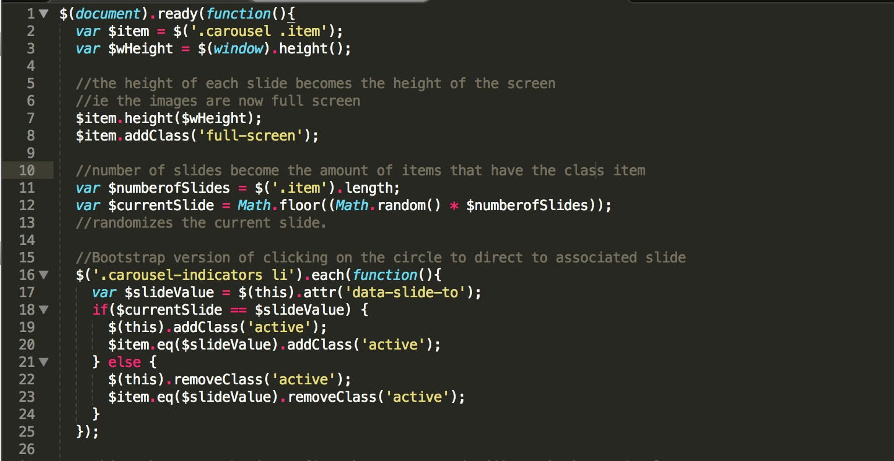
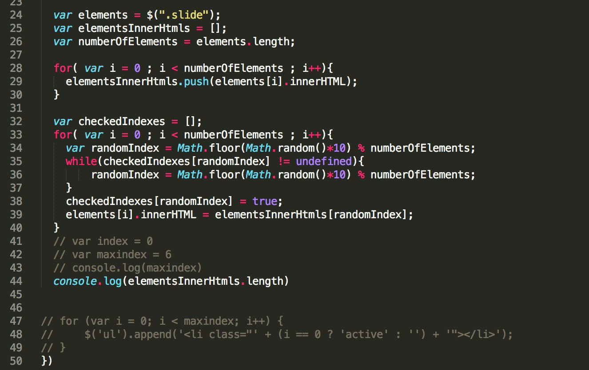
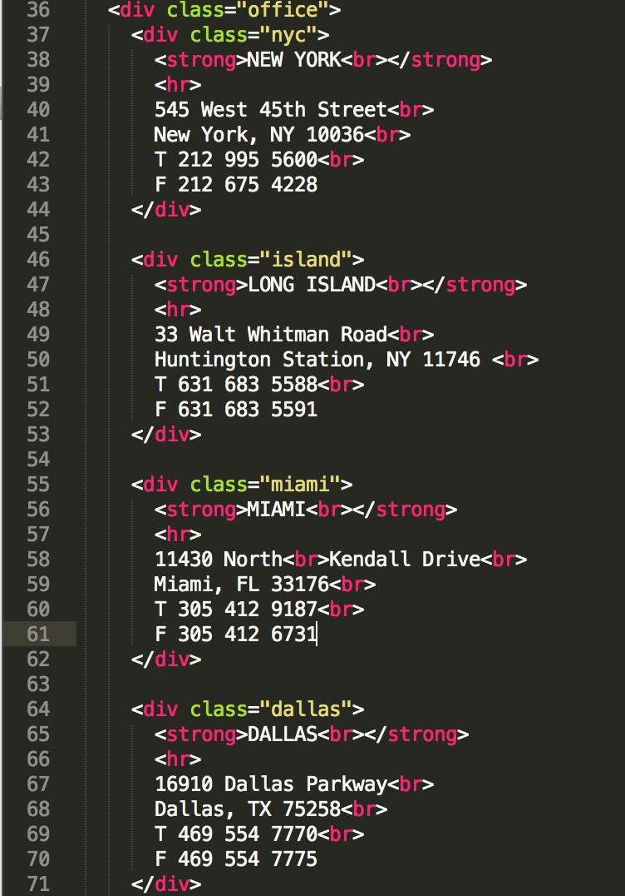

# SBLM

# Home
The home page uses a jquery based slideshow, DOM manipulation, and every page is mobile responsive.

Upon refresh the home page will shuffle an image with a link to the work page where clicked on studio is highlighted.

For example, clicking on the civic link in the home page, will highlight the civic projects in the work page, and so forth.

The photos chosen are in black and white to intice the user to continously click through the page until getting to a final project folder and ultimately see full color images with the according narrative. 

The only color in the page are the studios which guide the user to click on the divs that will direct them further onto the site. 

If the highlighted divs aren't an indicator the nav bar is, which will direct users to the work and contact page.

# Work
The work page contains selected projects by the SBLM curated by the principles. As of right now there are 20 projects with many more to come as proposals get completed. 

The work page is heavy on jquery and DOM manipulation as there is a shuffle function implemented where upon refresh the order of the projects is being changed. 

There is a filter bar where users can filter through each of the five studios and upon doing so the projects associated with the studio will be colorized. 
Hovering over a project will reveal it's title, and clicking on one will lead you to the project page where the user can learn more about the selected proposal and see site photography.

# Projects
The user will see a slideshow which consists of full bleed images. The curated slideshow images will consist of select aspect of the site and reflect a detail of the project.

Users can browse through the images via hovering over a certain section, hovering over the title or the bottom of the image will show an icon and upon click, the user will be scrolled to a site map with a + icon.

Upon clicking the + icon, the projet details will be revealed and the + will be replaced with a - which click on will remove the project details and show the site map.

Below the site map is a detailed flow of the project history, complete with a combination of photos and corresponding narrative.

# Contact
The contact page is simply a list of the offices with corresponding addresses and phone numbers. There is also the option to email SBLM for inquiries and employment opportunities.

# Future edits
### Home Page
For the home page, this is how to add more photos and other edits. 

This is the start of the slideshow. 

Lines 39-43 is the format for one image. There are multiple classes and id's. 

Line 39 is the start of the div, which wraps the whole code. 

Line 40 is basically the start of the image, lines 40-43 is the image and caption. 

Line 40, < div class = "slide current" >, every dive will have the class slide. The class current, basically means thats this is the first image that will be displayed. 

Then line 41 is the root file for the image. 
The last part , line 42, the href tag goes hand in hand with the h2 tag(civic). The a tag is the link that will lead you to the work page with the civic projects highlighted and pushed to the top. This applies to the other links as well. 

Line 47 is work/eduwork.html with the h2 tag as education, which means when clicked on the education link it will direct you to the work page with the education projects highlighted. 

### Nav Bar
This is the nav bar section, which is pretty straight forward.

It's basically a stylized list. The classes are sblm, and link. With the href linking to the corresponding pages. Clicking on the sblm logo on the home page is basically another way to refresh. The icon class with the burger class will be displayed only when the page is mobile responsive. 

Lines 27-32 are the links for when the page is mobile responsive. They become a different format and arent displayed unless the site is at a certain dimension and or viewed on a device.

### Photo js
The photojs is a bit more complicated, but I'll go through it line by line. I've also commented much of the code to make it easier to breeze through. 

Line 1 "$(document).ready(function(){" is necessary for any pages using jquery and is a vital tool for front end development. It basically means at the start of the page x,y, and z will prop itself. 

In Line 3 we are declating variables so the slides can move back and forth. Lines 6-20 is the slideshow function. Lines 16-19 are commented out, which is a separate thing that will be explained once I get it working. 

Line 7 is the current slide, line 8, is the next slide. 

Lines 9-11 is an if statement, which makes how many slides there are is the the amount of slides. $next.length equals just that. 

Lines 12-14 is basically removing and adding class, removing the current class and adding the previous class and adding current class. 

Line 15 means that move through each slide for 3000 milliseconds or 3 seconds per slide. 

Line 21 just sets intices the function. To change the speed of the slide edit 
line 15 and change the '3000' part to the speed you desire.

### Photo js pt 2
The second part to the photo.js file.

This is the shuffle function. Which basically is upon refresh the order of images are continously shuffled. For example, lets give each image a number. [1,2,3,4,5], upon the shuffle function, the image order would be [4,2,5,1,3], and so forth and so forth. Lines 24-26 are calling upon variables to populate 
later. 

Var elements = $('.slide'); Means all elements with the class slide will have the variable elements associated to it. 

Var elementsInnerHtmls = []; Is just an empty array, which will be used for later to push variables into it. 

Var numberOfELements = elements.length; Means the actual number of items with the class of slide. Basically taking a variable's characterstic and giving it a name. 

Lines 28 and onward:
This is where it may get a bit confusing.
Lines 28-30: means that for all number of elements which is 5, take the divs html code of each image and push it into the empty array which is elementsInnerHtml.

Line 32: 
Var CheckedIndexes = []; Which is an empty array, which we'll populate later

Lines 33-40 is a for statement:
Math.random is the js version of randomizing elements. So Var Random index equals randoming the array of elements and if it becomes undefined shuffle it again, which is an infinity loop.

Line 38: Means That any array pushed into CheckedIndexes will be randomized and it's true.

Line 39: The elements inner html's will equal the array of elements inner html, randomized. So, at the end of the function, the divs get stripped, calculated, shuffled, and then pushed back. 

### Contact Page

This page is fairly simple, The locations are wrapped in a dive called office, and each location is given a class of where they are, i.e 'nyc.' The br tags are just breaks for layout purposes.

